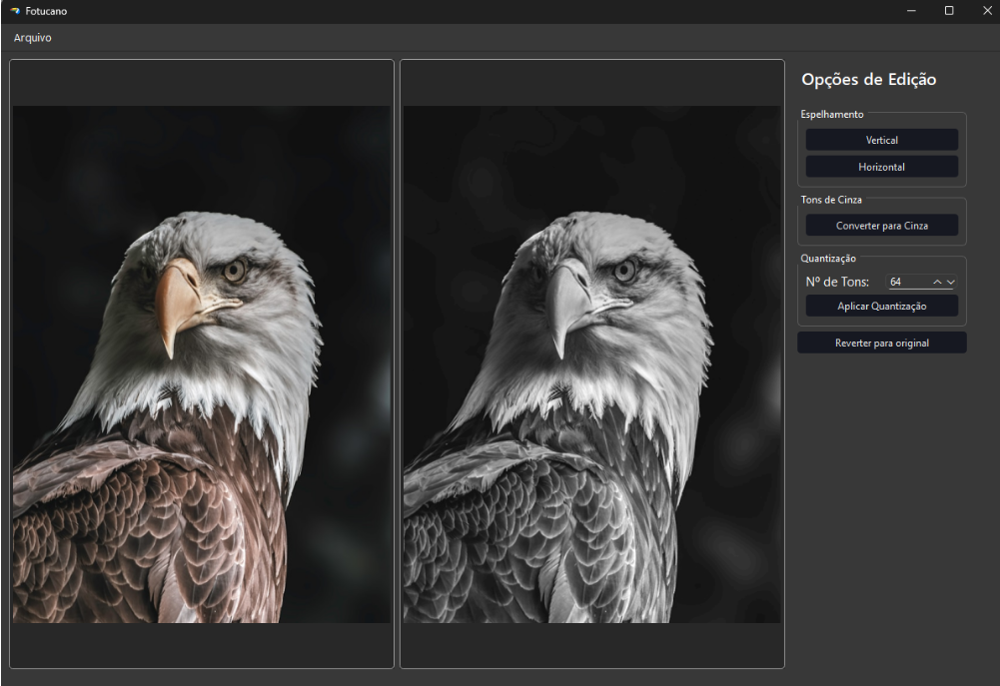

## Fotucano

Fotucano is a very simple image edition app build on top of C++ Qt for a Image Processing course. As of now, you are able to:
- Mirror images, vertically and horizontally
- Turn colored images to gray shades
- Apply shade quantization to gray images

A preview of fotucano's interface:

**You can find an exacutable for the app on the release page**
